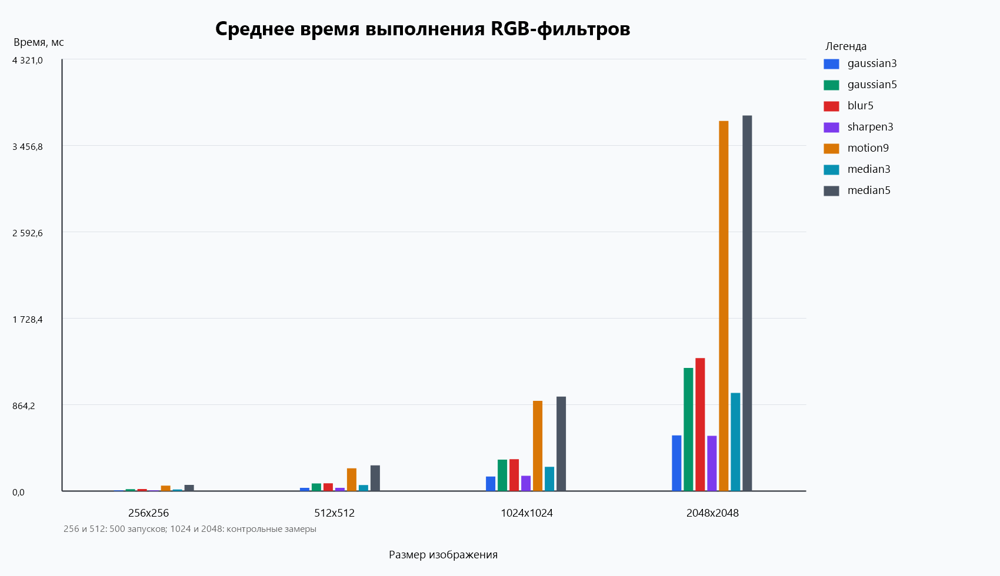
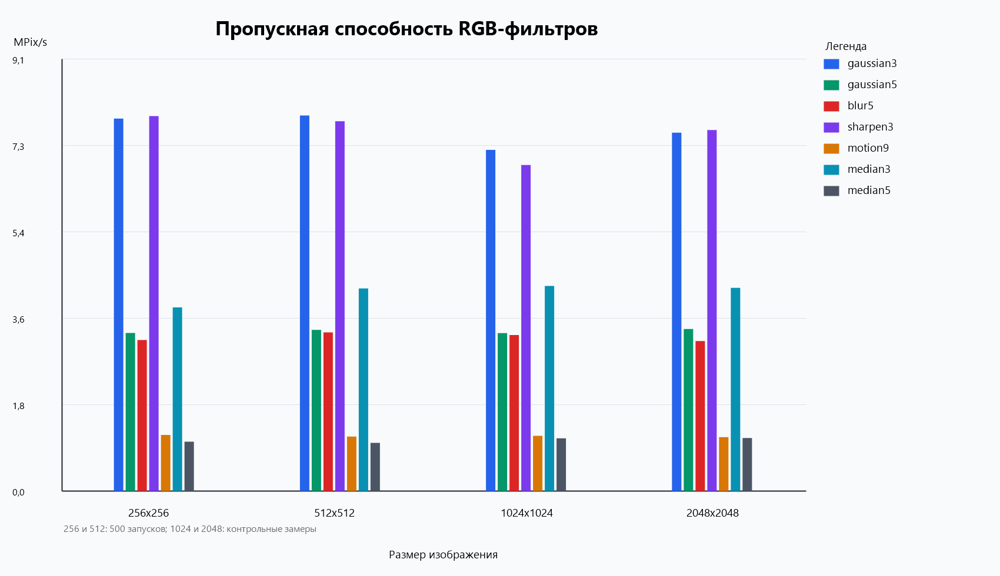

# Задание 1: последовательная фильтрация цветных изображений

## Описание

В проекте реализована последовательная обработка цветных RGB-изображений с использованием линейной свёртки и median filter.

Код разложен по пакетам:

- `image` — загрузка, сохранение и хранение RGB-изображения
- `filter` — последовательные фильтры, ядра свёртки и median filter
- `app` — логика командной строки

Изображение хранится как массив RGB-байтов: на каждый пиксель приходится 3 канала. Фильтры применяются независимо к каналам `R`, `G` и `B`, поэтому результат остаётся цветным.

## Сборка и запуск

Требования:

- Git
- Maven
- Java 24

Сборка:

```bash
mvn clean package
```

Применить фильтр:

```bash
java -cp target/classes app.Main apply <input> <output> <filterName>
```

Пример:

```bash
java -cp target/classes app.Main apply input.png output.png gaussian3
```

Замер производительности:

```bash
java -cp target/classes app.Main benchmark <input> <filterName> <iterations>
```

Пример:

```bash
java -cp target/classes app.Main benchmark input.png gaussian3 500
```

## Поддерживаемые фильтры

- `identity`
- `blur3`
- `blur5`
- `gaussian3`
- `gaussian5`
- `gaussian3_exact`
- `motion9`
- `edge_horizontal5`
- `edge_vertical5`
- `edge_45deg5`
- `edge_all3`
- `sharpen3`
- `sharpen5`
- `edge_excessive3`
- `emboss3`
- `emboss5`
- `mean3`
- `median3`
- `median5`
- `median7`

## Тестирование

Проверяются основные свойства реализации:

- `identity` не меняет RGB-данные
- нулевое ядро даёт чёрное изображение
- размер результата совпадает с размером входного изображения
- длина массива равна `width * height * 3`
- значения каналов остаются в диапазоне `0..255`
- median filter не меняет константное цветное изображение
- median filter удаляет одиночный импульсный шум по каждому каналу

Запуск тестов:

```bash
mvn test
```

## Исследование производительности

Замеры пересчитаны для цветной RGB-версии. В отличие от старой grayscale-версии, каждый пиксель обрабатывается по трём каналам.

Параметры стенда:

- ОС: Windows 11 Pro
- CPU: 11th Gen Intel(R) Core(TM) i7-11370H @ 3.30 GHz
- RAM: 16 ГБ
- Java runtime: Java 24
- компиляция проекта: Java 22
- изображения: `256x256`, `512x512`, `1024x1024`, `2048x2048`
- фильтры: `gaussian3`, `gaussian5`, `blur5`, `sharpen3`, `motion9`, `median3`, `median5`
- количество запусков для `256x256` и `512x512`: `500`
- для `1024x1024` и `2048x2048` оставлены контрольные замеры, потому что полный RGB-прогон всех фильтров на `500` итерациях занимает слишком много времени для интерактивной проверки

### Графики





### Среднее время, мс

| Фильтр | 256x256 | 512x512 | 1024x1024 | 2048x2048 |
|--------|--------:|--------:|----------:|----------:|
| `gaussian3` | 8.376 | 33.226 | 146.312 | 557.145 |
| `gaussian5` | 19.727 | 77.419 | 315.840 | 1231.733 |
| `blur5` | 20.648 | 78.597 | 319.758 | 1330.607 |
| `sharpen3` | 8.319 | 33.734 | 153.078 | 552.967 |
| `motion9` | 55.531 | 228.407 | 902.549 | 3702.536 |
| `median3` | 16.981 | 61.565 | 243.313 | 982.028 |
| `median5` | 63.081 | 258.506 | 945.342 | 3757.349 |

### Пропускная способность, MPix/s

| Фильтр | 256x256 | 512x512 | 1024x1024 | 2048x2048 |
|--------|--------:|--------:|----------:|----------:|
| `gaussian3` | 7.824 | 7.890 | 7.167 | 7.528 |
| `gaussian5` | 3.322 | 3.386 | 3.320 | 3.405 |
| `blur5` | 3.174 | 3.335 | 3.279 | 3.152 |
| `sharpen3` | 7.877 | 7.771 | 6.850 | 7.585 |
| `motion9` | 1.180 | 1.148 | 1.162 | 1.133 |
| `median3` | 3.859 | 4.258 | 4.310 | 4.271 |
| `median5` | 1.039 | 1.014 | 1.109 | 1.116 |

## Вывод

Цветная версия выполняет ту же фильтрацию отдельно для трёх каналов, поэтому она заметно тяжелее старой grayscale-версии. Время растёт почти пропорционально числу пикселей и сложности окна фильтра. Самыми тяжёлыми остаются `motion9` и `median5`, потому что они требуют больше операций на каждый пиксель.
